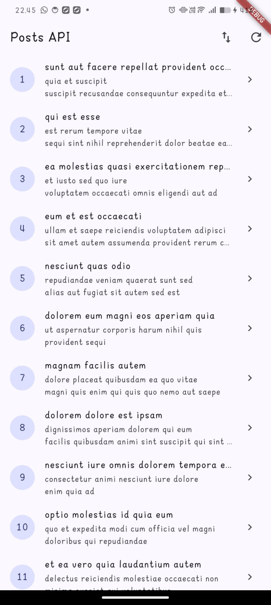
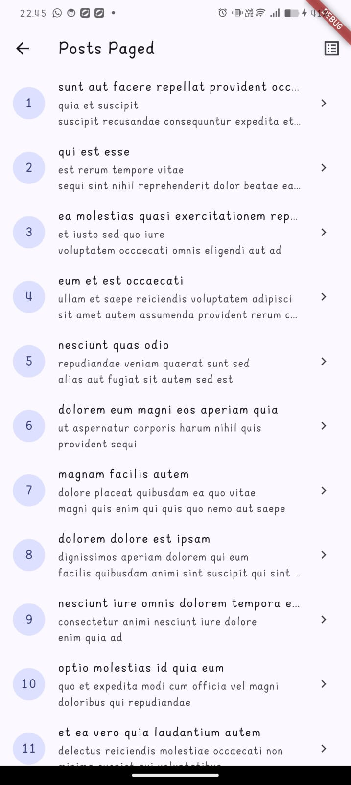

# Week 4 — Networking & REST API

**Mata Kuliah:** Pemrograman Mobile  
**Minggu:** 04  
**Topik:** HTTP, REST API, Null-Safe Serialization, Repository Pattern, Dio, AsyncNotifier, Infinite Scroll Pagination, dan AI Challenge  

---

## 👤 Identitas Mahasiswa
- **Nama:** Muhammad Faiq Nabil Saputra  
- **NIM:** 244107020025  
- **Kelas / Program Studi:** TI-3D / D4 Teknik Informatika  
- **Jurusan:** Jurusan Teknologi Informasi — Politeknik Negeri Malang  

---

## 🎯 Tujuan Pembelajaran
Setelah menyelesaikan modul jobsheet Minggu 4 ini, mahasiswa mampu:
1. Menjelaskan konsep protokol HTTP, arsitektur REST API, dan pertukaran data format JSON.
2. Memetakan JSON ke model objek Dart (*serialization*) dengan penanganan tipe data yang defensif dan aman null (*null-safe*).
3. Menerapkan **Repository Pattern** dasar sehingga antarmuka pengguna (UI) terisolasi dan tidak berinteraksi langsung dengan HTTP client.
4. Mengonfigurasi library **Dio** (base URL, timeouts, logging interceptor) serta memetakan exception jaringan (`DioException`) menjadi pesan kesalahan yang ramah pengguna.
5. Menampilkan state *loading*, *error* (+ retry), *empty*, dan *success* pada UI secara deklaratif menggunakan **AsyncValue** dan **Riverpod**.
6. Menerapkan teknik paginasi bertahap (*infinite scroll*) dengan mekanisme *guard* ganda untuk mencegah pemanggilan ganda (*duplicate requests*).
7. Memanfaatkan AI Coding Assistant secara kritis dan bertanggung jawab untuk membangun layer repository baru (`/comments`), melakukan verifikasi checklist arsitektur, dan mendokumentasikan proses evaluasinya.

---

## 📚 Ringkasan Teori & Konsep

### 1. HTTP, REST API, & Serialization Null-Safe
- **HTTP & REST:** Komunikasi client-server berbasis request-response menggunakan kata kerja standar (`GET`, `POST`, `PUT/PATCH`, `DELETE`). Setiap respons server membawa status code (2xx Sukses, 4xx Client Error, 5xx Server Error).
- **Serialization Defensif:** Mengingat data dari endpoint publik sering kali memiliki inkonsistensi tipe atau field yang hilang (`null`), parsing JSON menggunakan pola defensif:
  ```dart
  userId: (json['userId'] as num?)?.toInt() ?? 0,
  title: json['title'] as String? ?? '',
  ```
  Pola ini mencegah runtime exception fatal `type 'Null' is not a subtype of type...`.

### 2. Repository Pattern
Arsitektur aplikasi memisahkan tanggung jawab:
- **UI (ConsumerWidget):** Hanya membaca state dari Provider dan menangani interaksi pengguna.
- **Provider (Riverpod):** Mengelola siklus hidup data, memicu pemanggilan repository, dan mengekspos `AsyncValue` ke UI.
- **Repository:** Menjadi satu-satunya gerbang data yang melakukan panggilan HTTP via Dio dan mengonversi data mentah menjadi model domain.

$$\text{UI (ConsumerWidget)} \xrightarrow{\text{watch}} \text{Provider (AsyncValue)} \xrightarrow{\text{call}} \text{Repository} \xrightarrow{\text{HTTP}} \text{REST API}$$

### 3. Dio vs http Package
Library `dio` dipilih karena menyediakan:
- Timeout bawaan per-request (`connectTimeout`, `receiveTimeout`).
- Interceptor terpusat untuk logging (`LogInterceptor`) dan header autentikasi.
- Error handling terstruktur dengan `DioException` dan pengelompokan `DioExceptionType`.

### 4. Paginasi & Infinite Scroll
Untuk data berukuran besar, pemuatan dilakukan per halaman menggunakan query parameter (`_page` dan `_limit`). `ScrollController` digunakan untuk mendeteksi kapan posisi scroll pengguna mendekati ujung daftar (200px sebelum batas akhir) untuk memicu pemuatan data halaman selanjutnya tanpa me-reload data yang sudah ada.

---

## 🛠️ Implementasi Praktikum

### 1. Praktikum 1 — Dio dan Model Data
- Menginisialisasi project Flutter `week4_api` dan menambahkan package `dio` serta `flutter_riverpod`.
- **Model Data:** Mengimplementasikan model `Post` di [lib/data/models/post.dart](lib/data/models/post.dart) dengan constructor factory `fromJson` yang aman null.
- **Dio Terpusat:** Mengonfigurasi Dio di [lib/data/api_client.dart](lib/data/api_client.dart) dengan base URL JSONPlaceholder `https://jsonplaceholder.typicode.com`, timeout 10 detik, dan `LogInterceptor`.
- **Repository Layer:** Membangun `PostRepository` di [lib/data/repositories/post_repository.dart](lib/data/repositories/post_repository.dart) dengan method `fetchPosts()`.

### 2. Praktikum 2 — Provider dan Error Handling
- **Provider Layer:** Mengimplementasikan `dioProvider`, `postRepositoryProvider`, dan `PostListNotifier` (turunan dari `AsyncNotifier<List<Post>>`) di [lib/data/providers.dart](lib/data/providers.dart).
- **Error Mapping:** Membuat fungsi `friendlyErrorMessage(Object error)` di [lib/data/network_errors.dart](lib/data/network_errors.dart) yang memetakan jenis error `DioExceptionType` (koneksi timeout, server down, 404, 500) menjadi kalimat yang informatif bagi pengguna.
- **UI Komprehensif:** Membangun [lib/pages/post_list_page.dart](lib/pages/post_list_page.dart) dengan penanganan 4 state:
  - *Loading:* `CircularProgressIndicator`.
  - *Error:* Pesan ramah + tombol **Coba lagi** (`ref.invalidate(postListProvider)`).
  - *Empty:* Menampilkan teks saat data kosong.
  - *Success:* `RefreshIndicator` + `ListView.builder` menampilkan list kartu post.
- **Main Entry:** Membungkus root widget dengan `ProviderScope` di [lib/main.dart](lib/main.dart).

### 3. Praktikum 3 — Pagination Dasar (Infinite Scroll)
- **Repository Paged:** Menambahkan method `fetchPostsPage({required int page, int limit = 10})` pada `PostRepository`.
- **Paged State & Notifier:** Membuat `PagedPostsState` dan `PagedPostsNotifier` di [lib/data/paged_posts.dart](lib/data/paged_posts.dart) dengan proteksi guard `if (state.isLoadingMore || !state.hasMore) return;` agar tidak terjadi request ganda.
- **Infinite Scroll UI:** Membangun [lib/pages/paged_post_page.dart](lib/pages/paged_post_page.dart) menggunakan `ScrollController` yang memicu pemuatan otomatis saat mencapai ujung list dan menampilkan indikator loading di footer list.

---

## 🤖 AI Challenge & Verifikasi Mandiri

Sesuai instruksi jobsheet, bagian ini mengeksplorasi penggunaan AI Coding Assistant untuk menghasilkan repository layer endpoint `GET /comments?postId={id}`.

### Ringkasan Hasil AI Challenge:
1. **Model Comment:** [lib/data/models/comment.dart](lib/data/models/comment.dart) dibuat dengan defensive parsing `num` dan penanganan `null`.
2. **CommentRepository:** [lib/data/repositories/comment_repository.dart](lib/data/repositories/comment_repository.dart) memanfaatkan `dioProvider` terpusat dan method `fetchComments(postId)`.
3. **Comment Providers:** [lib/data/comment_providers.dart](lib/data/comment_providers.dart) menyediakan `commentRepositoryProvider`, `CommentNotifier`, dan `commentsByPostProvider`.
4. **Dokumentasi Lengkap:** Seluruh detail prompt, perbaikan arsitektur, dan checklist verifikasi mandiri disimpan pada dokumen terpisah di [docs/ai_challenge.md](docs/ai_challenge.md).

---

## 🧪 Pengujian (Testing)

Pengujian komprehensif dijalankan untuk menguji serialisasi model `Post` & `Comment`, pemetaan error jaringan, serta simulasi pemanggilan API menggunakan `FakePostRepository` dan `FakeCommentRepository`:

```bash
flutter test
```

### Hasil Eksekusi Test (18 Tests Lulus):
```text
00:00 +0: test/comment_test.dart: Comment Model Tests Comment.fromJson aman saat semua field ada
00:00 +1: test/comment_test.dart: Comment Model Tests Comment.fromJson aman terhadap field yang hilang / null
00:00 +2: test/comment_test.dart: Comment Model Tests Comment.fromJson edge case: menangani string ID dan data tipe tidak terduga
00:00 +3: test/comment_test.dart: Comment Model Tests Comment.toJson menghasilkan map yang sesuai
00:00 +4: test/comment_test.dart: Network Errors Mapping Tests friendlyErrorMessage memetakan status 404
00:00 +5: test/comment_test.dart: Network Errors Mapping Tests friendlyErrorMessage memetakan status 401 dan 403
00:00 +6: test/comment_test.dart: Network Errors Mapping Tests friendlyErrorMessage memetakan status 500
00:00 +7: test/comment_test.dart: Network Errors Mapping Tests friendlyErrorMessage memetakan timeout
00:00 +8: test/comment_test.dart: Comment Provider Tests commentsByPostProvider mengembalikan data dengan FakeCommentRepository
00:00 +9: test/comment_test.dart: Comment Provider Tests CommentNotifier fetchComments memuat data ke AsyncData
00:00 +10: test/comment_test.dart: Comment Provider Tests CommentNotifier fetchComments menangkap error menjadi AsyncError
00:00 +11: test/post_test.dart: fromJson aman terhadap field yang hilang
00:00 +12: test/post_test.dart: friendlyErrorMessage untuk connection error
00:00 +13: test/post_test.dart: provider sukses dengan repository palsu
00:00 +14: test/post_test.dart: provider error dengan repository palsu
00:01 +15: test/post_test.dart: postDetailProvider mengambil detail dengan repository palsu
00:02 +16: test/widget_test.dart: App renders properly smoke test
00:03 +17: test/widget_test.dart: PostTile renders post title, body, and id correctly
00:04 +18: All tests passed!
```

---

## 📸 Tangkapan Layar (Screenshots)

Berikut adalah tampilan antarmuka aplikasi Flutter yang diambil langsung dari perangkat:

### 1. Tampilan Utama — Posts API (`PostListPage`)


**Penjelasan:**
- **Antarmuka Utama:** Menampilkan daftar postingan (*posts*) yang berhasil diambil dari REST API (`GET /posts`) secara *asynchronous* melalui `PostRepository` dan dikelola oleh Riverpod `postListProvider`.
- **Komponen UI (`PostTile`):** Setiap item baris menampilkan nomor ID postingan pada `CircleAvatar`, judul postingan (*title*), dan cuplikan deskripsi (*body*).
- **Aksi & Navigasi:** `AppBar` menyediakan tombol *refresh* untuk memicu pemuatan ulang data (`ref.read(postListProvider.notifier).refresh()`) serta tombol navigasi menuju halaman paginasi.

---

### 2. Tampilan Paginasi — Posts Paged (`PagedPostPage`)


**Penjelasan:**
- **Paginasi Server-Side (*Infinite Scroll*):** Menampilkan data secara bertahap (10 item per halaman) menggunakan query parameter `?_page=N&_limit=10` pada JSONPlaceholder API.
- **Deteksi Scroll Otomatis:** Menggunakan `ScrollController` yang memantau posisi scroll pengguna. Pemuatan data halaman selanjutnya (`loadNextPage()`) terpicu otomatis saat jarak scroll tersisa 200px dari ujung bawah.
- **Manajemen State Paged:** Menggunakan `PagedPostsNotifier` dengan mekanisme *double guard* (`if (state.isLoadingMore || !state.hasMore) return;`) untuk mencegah request ganda dan menjaga agar data yang sudah dimuat sebelumnya tidak hilang saat indikator *loading* bawah muncul.

---

## 📁 Struktur Direktori
```text
04-week-4-networking-rest-api/
├── lib/
│   ├── data/
│   │   ├── api_client.dart
│   │   ├── comment_providers.dart
│   │   ├── network_errors.dart
│   │   ├── paged_posts.dart
│   │   ├── providers.dart
│   │   ├── models/
│   │   │   ├── comment.dart
│   │   │   └── post.dart
│   │   └── repositories/
│   │       ├── comment_repository.dart
│   │       └── post_repository.dart
│   ├── pages/
│   │   ├── paged_post_page.dart
│   │   ├── post_detail_page.dart
│   │   └── post_list_page.dart
│   ├── widgets/
│   │   └── post_tile.dart
│   ├── router.dart
│   └── main.dart
├── test/
│   ├── comment_test.dart
│   ├── post_test.dart
│   └── widget_test.dart
├── docs/
│   ├── .gitkeep
│   └── ai_challenge.md
├── screenshots/
│   ├── paged_posts.jpeg
│   └── post_list.jpeg
├── pubspec.yaml
└── README.md
```

---

## 🚀 Cara Menjalankan

1. **Install dependencies:**
   ```bash
   flutter pub get
   ```
2. **Jalankan aplikasi:**
   ```bash
   flutter run
   ```
3. **Jalankan seluruh pengujian unit & widget:**
   ```bash
   flutter test
   ```
